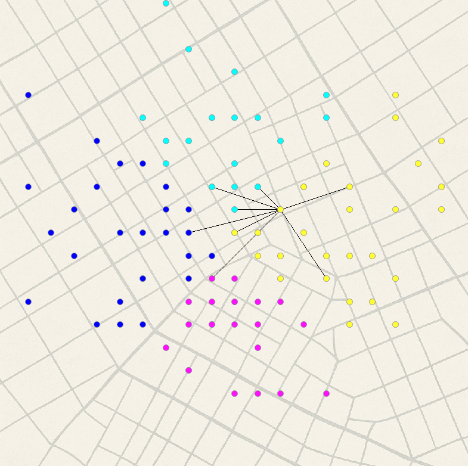
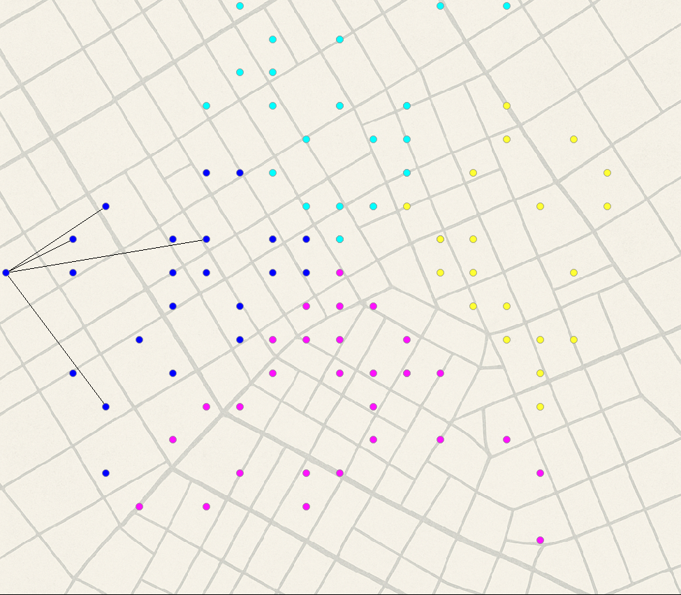
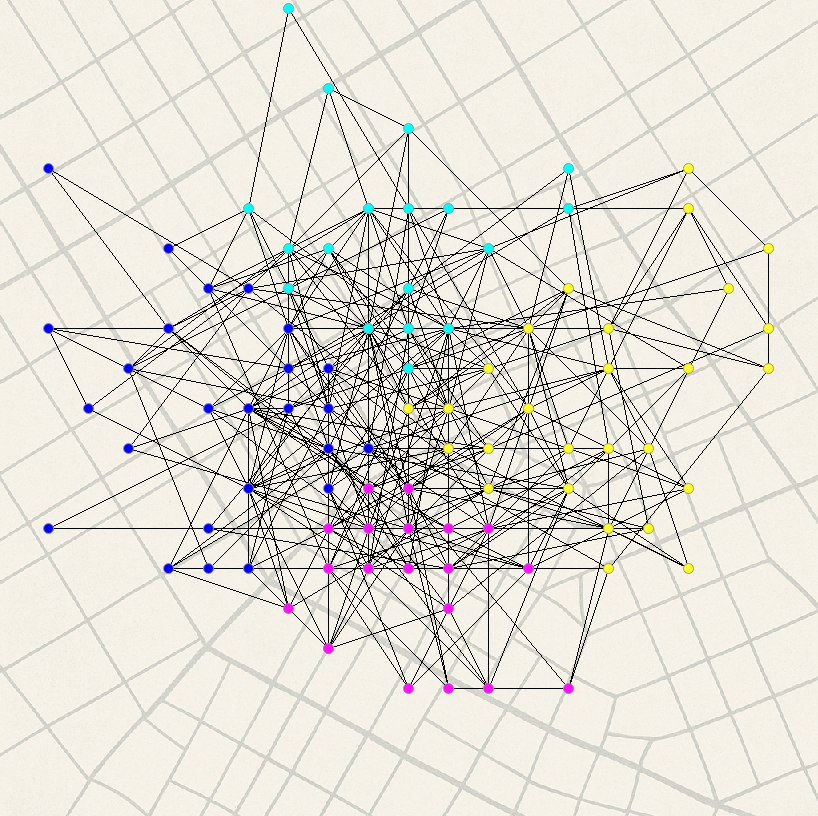
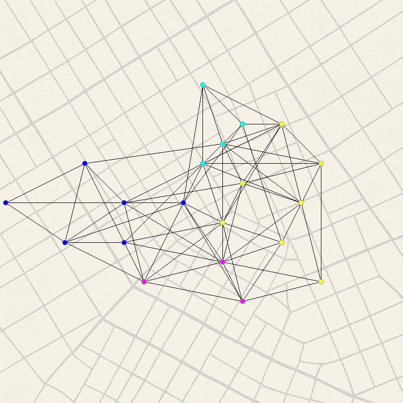
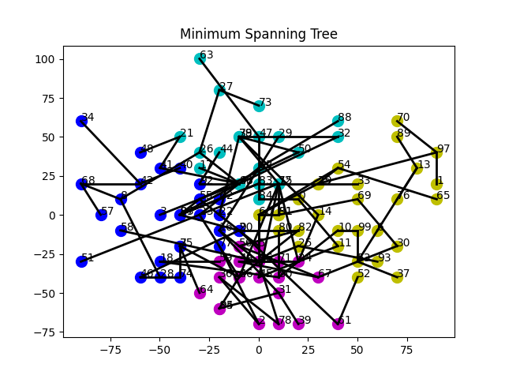
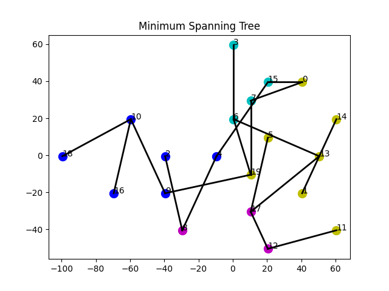
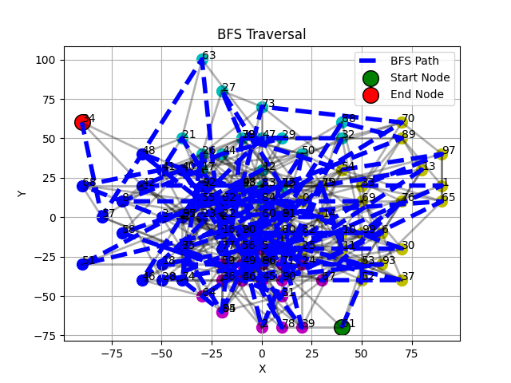
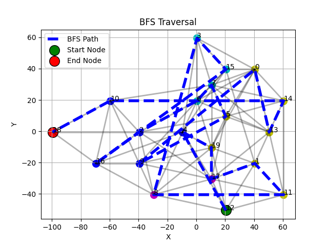

# Introduction

UrbanGraph is a graph-based urban traffic simulation system designed to
model and analyze user movements and traffic flow in a city-like
environment. The system dynamically generates a random graph
representing a city, where:

-   Nodes represent stations (in this case Universities).

-   Edges represent roads connecting the nodes.

-   The map is divided into four zones: North, South, East, and
    West---each with distinct colors.

Users (both automated and manual) traverse this graph, triggering
algorithms like A\* and TSP for route optimization and visualization.

# Clock and Tick System

The system employs a discrete clock-based mechanism to simulate
time-based events. Every 2 seconds (1 tick), two new random users are
spawned on the graph. These users traverse the graph in a semi-random
fashion to generate dynamic traffic patterns. This simulation enables a
temporal evolution of congestion and allows for performance analysis of
pathfinding algorithms under load.

## Tick Mechanics

Each tick involves:

-   Spawning new users

-   Assigning random start and destination nodes

-   Updating the graph state and visual animation

## Traffic Management

As users traverse the graph, traffic congestion is dynamically simulated
and managed to reflect realistic movement limitations. Each edge in the
graph has a defined **capacity**, representing the maximum number of
simultaneous users it can support. When the number of users exceeds this
threshold, the edge is considered *congested*.

UrbanGraph handles congestion in two key ways:

-   **Routing Penalty:** A\* pathfinding applies an additional cost when
    evaluating congested edges, making them less favorable for route
    selection.

-   **Real-time Visualization:** Congested edges can be styled
    differently or animated with delay effects to reflect slowdown.

This mechanism ensures that traffic buildup influences user movement
patterns over time, simulating a dynamic and reactive transport
environment.

{#fig:traffic-normal
width="\\textwidth"}

{#fig:traffic-congested
width="\\textwidth"}

# Random Graph Generation

The graph construction process in *UrbanGraph* aims to simulate a
realistic and fully connected urban layout. It begins by establishing a
reliable connectivity structure using a **random spanning tree**,
followed by the probabilistic addition of extra edges to introduce
redundancy and improve path diversity.

## Spanning Tree Initialization

To ensure the graph is initially connected, a random spanning tree is
generated. The process begins by selecting a random node as the starting
point. Then, nodes are incrementally connected in a randomized fashion:
each new edge links a randomly chosen *visited* node to a randomly
chosen *unvisited* node. This continues until all nodes are connected.
The resulting edge set forms a spanning tree --- a minimal structure
with no cycles that connects all nodes.

## Edge Densification

While a spanning tree ensures connectivity, it offers only a single
unique path between any two nodes, which is not reflective of real-world
road networks. To address this, the algorithm adds a number of extra
edges (approximately 2.5 times the number of nodes) to increase path
redundancy. These edges are selected using a distance-weighted
probabilistic approach:

-   Candidate node pairs are selected at random.

-   The probability of adding an edge between them decreases
    exponentially with their Euclidean distance.

This technique favors local connections, encouraging dense clusters and
realistic neighborhood patterns, while occasionally allowing longer
edges that connect distant zones, simulating arterial roads.

## Node Positioning and Layout

Once the edge set is finalized, a spring layout algorithm is used to
assign spatial coordinates to the nodes. This layout algorithm models
edges as springs and places nodes in two-dimensional space in a way that
minimizes edge crossing and distributes nodes uniformly.

To standardize rendering, the final layout is centered around the origin
and scaled, with coordinates rounded to simplify zone computation and
rendering precision.

### Node Interaction View {#nod

UrbanGraph also supports an interactive view where clicking on a node
reveals only its directly connected edges. This feature helps users
inspect local connectivity and understand how each node integrates into
the larger graph.

{width="\\textwidth"}
[]{#fig:node-click-1 label="fig:node-click-1"}

{width="\\textwidth"}
[]{#fig:node-click-2 label="fig:node-click-2"}

## Zone Assignment

Each node in the graph is assigned to one of four spatial zones based on
its $(x, y)$ coordinates. The assignment prioritizes vertical separation
(North/South) over horizontal (East/West), ensuring a consistent and
intuitive layout.

-   **North (Zone 0)**: $|y| > |x|$ and $y \geq 0$\
    *Color: Cyan (`#17becf`)*

-   **South (Zone 1)**: $|y| > |x|$ and $y < 0$\
    *Color: Magenta (`#e377c2`)*

-   **East (Zone 2)**: $|x| \geq |y|$ and $x \geq 0$\
    *Color: Yellow (`#bcbd22`)*

-   **West (Zone 3)**: $|x| \geq |y|$ and $x < 0$\
    *Color: Blue (`#1f77b4`)*

{#fig:mst-1
width="\\textwidth"}

{#fig:mst-2
width="\\textwidth"}

# Travel and Route Computation

## A\* Pathfinding Algorithm

UrbanGraph uses the A\* search algorithm to compute efficient travel
routes between stations (nodes) within the city graph. A\* is chosen for
its balance of performance and optimality, combining the benefits of
Dijkstra's algorithm with heuristic-driven search.

### Heuristic Design 

The heuristic used in UrbanGraph considers two factors:

-   **Geometric Distance**: The Euclidean distance between the current
    node and the goal node.

-   **Zone Transition Cost**: A penalty based on the number of zone
    boundaries crossed (e.g., moving from South to East). This is
    weighted to encourage intra-zone travel when possible.

The final heuristic formula is:
$$h(n) = 0.7 \cdot \text{distance}(n, \text{goal}) + 0.3 \cdot \text{zone\_difference}(n, \text{goal}) \times 10$$
This allows the algorithm to prioritize spatial proximity while still
accounting for logical travel costs between urban zones.

### Edge Handling and Traffic Sensitivity {#edge-handling-an

Each edge has a defined capacity. If an edge is congested (i.e., its
number of current passengers exceeds capacity), a penalty is applied to
its weight to simulate traffic delays. This discourages the algorithm
from routing through heavily congested areas unless no better options
exist. Congestion is handled as follows:

-   Normal edge: uses base weight.

-   Congested edge: weight is increased by a penalty factor.

### Multi-Zone Travel and Border Nodes {#multi-zone-travel-an

When a route spans multiple zones (e.g., from North to West), UrbanGraph
uses a two-phase strategy involving **border nodes**, which are nodes
located near zone boundaries and flagged during graph preprocessing:

1.  Compute paths from the start node to all possible border nodes in
    the target zone.

2.  For each such border, compute a secondary path to the final goal.

3.  Select the combination with the lowest total cost.

::: algorithm
::: algorithmic
$node1\_zone \gets start\_node.zone$ $node2\_zone \gets goal\_node.zone$

$key \gets \text{concat}(\min(node1\_zone, node2\_zone), \text{"to"}, \max(node1\_zone, node2\_zone))$
$best\_cost \gets \infty$ $best\_path \gets \text{None}$
$best\_edges \gets \text{None}$

$candidates \gets border\_nodes[key]$ $trimed\_dict \gets$
$candidates \gets$ $trimed\_dict$

$(path1, edges1) \gets$ $(path2, edges2) \gets$

**continue**

$cost \gets \sum(e.weight$ **for** $e$ **in** $edges1 + edges2)$

$best\_cost \gets cost$ $best\_path \gets path1[:-1] + path2$
$best\_edges \gets edges1 + edges2$

$(best\_path, best\_edges)$
:::
:::

This design reduces unnecessary zone-hopping and makes routing more
efficient and realistic in zoned urban networks. You can see our
recursive D&Q algorithm in
algorithm[\[alg:a_star_zone\]](#alg:a_star_zone){reference-type="ref"
reference="alg:a_star_zone"}

##

The A\* algorithm returns:

-   A list of nodes representing the optimal path.

-   A corresponding list of edges traversed, used for animation and
    visualization.

If no valid path is found (e.g., all routes are blocked or unreachable),
the algorithm returns a failure state, which is handled by the
interface.

##

The selected path is animated on the graph, with directional
highlighting of edges. Congested paths can be visually distinguished by
their traversal delay or special styling.

## Traveling Salesman Problem (TSP) with A\*

In addition to computing shortest paths between two individual points,
UrbanGraph supports multi-goal pathfinding by integrating the
**Traveling Salesman Problem (TSP)**. This allows a user to select
multiple destinations, and the system computes the most efficient route
that visits all of them starting from a source node.

##

The solution uses a dynamic programming (DP) approach to approximate the
optimal path while incorporating real route costs obtained from the A\*
algorithm. This hybrid method is both computationally efficient and
spatially realistic in an urban navigation context.

### Graph-Aware Cost Matrix {#graph-awar

A key part of this implementation is the construction of a distance
matrix between the source node and all destination nodes:

-   A\* is used to compute the actual travel cost from the source to
    each destination.

-   A pairwise cost is computed between every two destination nodes
    using A\* again.

-   The resulting matrix reflects real traversal costs that consider
    traffic, edge weights, and zone transitions.

### Dynamic Programming Formulation {#dynami

The algorithm constructs a DP table where:

-   Each state represents a bitmask of visited nodes.

-   Each entry tracks the minimum cost to reach a subset of destinations
    ending at a particular node.

-   Transitions update the table by considering the cost of moving from
    one node to another, using the precomputed A\* distances.

The goal is to find the minimum-cost path that visits all destinations
exactly once.

The TSP solution constructs a dynamic programming (DP) matrix to track
the minimum cost of reaching each subset of destinations. The matrix is
defined as:

$$\text{dp}[S][j] = \text{minimum cost to reach destination } j \text{ having visited the set } S$$

where:

-   $S$ is a bitmask representing a subset of visited destinations.

-   $j \in [0, n-1]$ is the index of the last visited destination.

-   $n$ is the total number of destinations.

-   Costs are computed using A\* for each path between destination
    nodes.

An example for $n = 3$ destinations ($D_0, D_1, D_2$):

$$\begin{array}{c|ccc}
\textbf{Mask (S)} & D_0 & D_1 & D_2 \\
\hline
000 & \infty & \infty & \infty \\
001 & c_{s \rightarrow D_0} & \infty & \infty \\
010 & \infty & c_{s \rightarrow D_1} & \infty \\
100 & \infty & \infty & c_{s \rightarrow D_2} \\
011 & c_{D_1 \rightarrow D_0} & c_{D_0 \rightarrow D_1} & \infty \\
101 & c_{D_2 \rightarrow D_0} & \infty & c_{D_0 \rightarrow D_2} \\
110 & \infty & c_{D_2 \rightarrow D_1} & c_{D_1 \rightarrow D_2} \\
111 & \cdots & \cdots & \cdots \\
\end{array}$$

Here:

-   Each row corresponds to a bitmask subset of visited destinations.

-   Each column represents the destination node the path ends at.

-   $c_{u \rightarrow v}$ denotes the A\*-computed cost from node $u$ to
    node $v$.

-   Initial entries are seeded using costs from the source node.

The final result is taken from the row corresponding to $S = 111$ (all
destinations visited), and the column with the lowest value.

### Path Reconstruction 

Once the DP table is filled:

1.  The end node with the lowest cost is selected.

2.  The path is backtracked through the DP table to recover the node
    visitation sequence.

3.  A\* is rerun on each segment to regenerate the exact node and edge
    path for animation and visualization.

### Features and Benefits {#feature

-   Realistic cost modeling through A\* integration.

-   Considers zone boundaries and traffic conditions.

-   Efficient even for moderate numbers of destinations (up to 10--15).

-   Produces paths ready for smooth animation in the user interface.

### Output 

The algorithm outputs:

-   Total estimated travel cost

-   The optimal node visitation sequence

-   A list of nodes and edges traversed (with duplicate suppression)

This system enhances UrbanGraph's utility in logistics and route
planning scenarios where multiple stops must be handled optimally.

# Minimum Spanning Tree (MST)

UrbanGraph includes an interactive visualization of the **Minimum
Spanning Tree (MST)** of the graph, computed using Prim's algorithm.
This allows users to explore the minimal structure that connects all
stations (nodes) with the least total edge cost.

## Prim's Algorithm Overview {#prim

The MST is generated using a variant of Prim's algorithm:

-   The algorithm begins at an arbitrary start node.

-   At each step, it adds the minimum-weight edge that connects a
    visited node to an unvisited one.

-   This continues until all nodes have been included in the MST.

Each edge in the MST retains metadata such as weight, capacity, and
color, ensuring consistency with the original graph and enabling
intuitive visualization.

## MST Construction and Properties {#mst-constructio

The algorithm operates on an adjacency list representation of the graph.
Edges are prioritized by weight using a min-heap structure. Additional
properties preserved in the MST include:

-   **Edge Capacity**: Used for potential traffic simulation.

-   **Color**: Each MST edge inherits its color from the original edge
    for zone consistency.

The total weight of the MST is calculated and can be used to assess the
minimal infrastructure cost of keeping the network connected.

## Interactive Visualization 

UrbanGraph generates a separate, interactive plot of the MST that
includes:

-   **Nodes**: Colored according to their zone.

-   **MST Edges**: Drawn using the original edge color and rendered with
    increased thickness.

-   **Labels**: Node IDs are overlaid for identification and analysis.

{#fig:mst-1
width="\\textwidth"}

{#fig:mst-2
width="\\textwidth"}

This visualization enables users to explore the MST structure
independently of the full traffic simulation and can serve educational,
analytical, or debugging purposes.

#

The MST mode serves multiple roles within UrbanGraph:

-   Visualizing the core backbone of the network.

-   Comparing full connectivity versus minimal connection models.

-   Supporting future integration with cost-optimized planning tools.

The MST module thus enhances UrbanGraph's ability to serve as both a
dynamic simulation and a structural analysis platform.

# Breadth-First Search (BFS)

UrbanGraph includes support for performing and visualizing
**Breadth-First Search (BFS)** from any node selected by the user. BFS
provides a level-wise exploration of the network and is a valuable tool
for educational purposes and spatial analysis.

## Traversal Mechanism 

Breadth-First Search is initiated from a user-selected node and proceeds
by exploring all neighboring nodes before moving outward to the next
level. It uses a queue to maintain traversal order and a set to track
visited nodes, ensuring each node is visited only once.

-   The algorithm begins at the selected start node.

-   It explores all directly connected neighbors.

-   This process continues layer by layer until all reachable nodes are
    visited.

The final path represents the order in which nodes were discovered.

## Interactive Visualization {#interactiv

UrbanGraph renders the BFS traversal in an interactive and visual
format:

-   **Nodes**: Displayed and colored according to their zone.

-   **Original Edges**: Shown in the background with partial
    transparency.

-   **Traversal Path**: The path of visited nodes is overlaid with a
    dashed blue line.

-   **Start Node**: Highlighted in green with a black border.

-   **Final Node**: Highlighted in red with a black border.

{#fig:bfs-1
width="\\textwidth"}

{#fig:bfs-2
width="\\textwidth"}

This layout allows users to visually trace the breadth-first exploration
in both spatial and logical order.

## Use Cases 

The BFS module serves several practical and pedagogical roles:

-   Understanding the structure and density of local neighborhoods.

-   Visualizing how search algorithms propagate in a graph.

-   Validating graph connectivity in real time.

## Integration with Simulation {#integratio

Though BFS is not used for routing in UrbanGraph, it provides insight
into the graph's topology and complements other algorithmic features
such as A\* and MST. Users may invoke BFS at any time during the
simulation for exploration or analysis.

# Time and Space Complexity

This section analyzes the time and space complexity of the major
algorithms used in *UrbanGraph*. Each algorithm is evaluated in terms of
its computational efficiency with respect to the number of nodes $n$ and
edges $e$ in the graph.

## A\* Search 

A\* combines Dijkstra's algorithm with a heuristic function to
prioritize exploration.

-   **Time Complexity:** $O(e \log n)$ when using a binary heap for the
    priority queue. In dense graphs or with many neighbors, the runtime
    can approach $O(n^2)$.

-   **Space Complexity:** $O(n)$ for storing scores, visited nodes, and
    the open/closed sets.

The heuristic function used in UrbanGraph includes both geometric
distance and zone transition penalties, improving performance in
spatially structured networks.

## TSP Solver (with A\* Cost Evaluation)

The TSP module employs a dynamic programming solution with bitmasking to
track subsets of visited destinations, and A\* is used to compute real
pairwise distances.

-   **Time Complexity:** $O(n^2 \cdot 2^n)$, where $n$ is the number of
    destinations.

-   **Space Complexity:** $O(n \cdot 2^n)$ for storing the DP table.

## Minimum Spanning Tree (MST) {#minimum-spanning-tre

UrbanGraph computes the MST using Prim's algorithm with a priority
queue.

-   **Time Complexity:** $O(e \log n)$ when using a binary heap.

-   **Space Complexity:** $O(n + e)$ for storing the graph structure and
    MST.

This algorithm ensures full connectivity with minimal total weight and
supports filtering by zone.

## Breadth-First Search (BFS)

BFS is used for level-order exploration of the graph starting from a
selected node.

-   **Time Complexity:** $O(n + e)$ --- each node and edge is visited
    once.

-   **Space Complexity:** $O(n)$ for the visited set and queue.

# Installation
```bash
git clone https://github.com/Ohtears/UrbanGraph.git
cd UrbanGraph
pip install -r requirements.txt
```

# Conclusion


UrbanGraph offers a modular and visually engaging way to explore
pathfinding and graph algorithms in an urban context. The simulation
demonstrates how computational strategies can be applied to traffic and
logistics challenges.